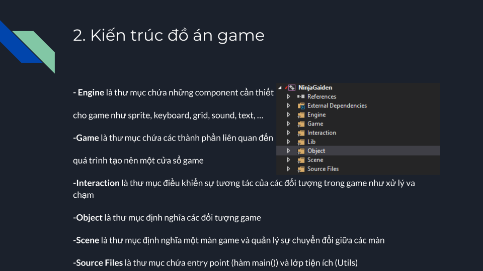

# NinjaGaiden
```
This is presentation of a game project. Specifically, it is Ninja Gaiden
How to design a basic game with OOP
The basic components in game
```
## Slide





## Technical Support or Questions
If you have questions or need help integrating the product please "thanh29695@gmail.com" instead of opening an issue
